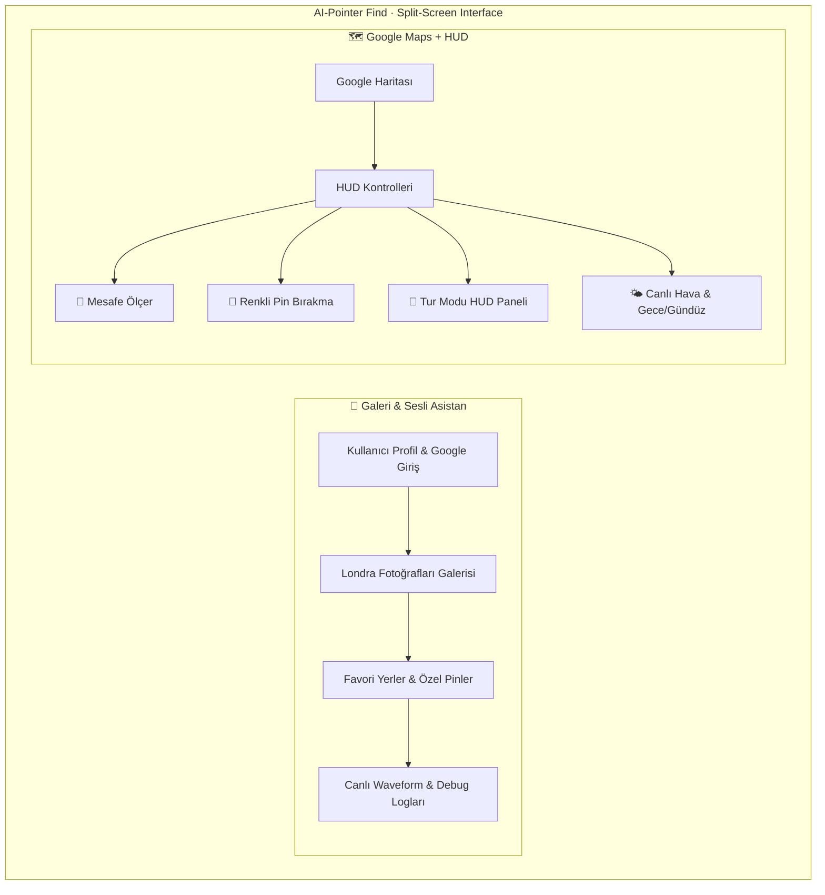

<div align="center">


<br /><br />

<a href="https://aipointerfind.vercel.app"></a>

<br />


<br />


<br /><br />

```text
 █████╗ ██╗    ██████╗  ██████╗ ██╗███╗   ██╗████████╗███████╗██████╗
██╔══██╗██║    ██╔══██╗██╔═══██╗██║████╗  ██║╚══██╔══╝██╔════╝██╔══██╗
███████║██║    ██████╔╝██║   ██║██║██╔██╗ ██║   ██║   █████╗  ██████╔╝
██╔══██║██║    ██╔═══╝ ██║   ██║██║██║╚██╗██║   ██║   ██╔══╝  ██╔══██╗
██║  ██║██║    ██║     ╚██████╔╝██║██║ ╚████║   ██║   ███████╗██║  ██║
╚═╝  ╚═╝╚═╝    ╚═╝      ╚═════╝ ╚═╝╚═╝  ╚═══╝   ╚═╝   ╚══════╝╚═╝  ╚═╝
                          F  I  N  D
```

### **Konuş. İşaret et. Keşfet.**
### Sesle ve işaretleyerek kontrol edilen, Google Maps üzerinde canlı çalışan interaktif Londra gezi rehberi.

</div>

---

<div align="center">

### 🌐 Canlı Site — **[aipointerfind.vercel.app](https://aipointerfind.vercel.app)**

</div>

> **Vercel deploy notu:** Site statik Vite build olarak Vercel'de yayında. Gemini, Google Maps ve Firebase (client-side) çalışır. Gerçek zamanlı çoklu-imleç (Socket.io) özelliği ayrı Express sunucu gerektirdiğinden Vercel serverless'ta devre dışıdır — tam multiplayer için `npm run dev` / kendi sunucun. Gemini sesli özellikleri için Vercel panelinden `GEMINI_API_KEY` build env değişkenini eklemen gerekir.

---

## ✦ AI-Pointer: Find nedir?

**AI-Pointer: Find**, **Google Gemini Live** ses ve işaretleme (pointer / gesture) yeteneklerini **Google Maps Platform** ile birleştiren, **Firebase** üzerinden senkronize çalışan interaktif bir Londra gezi rehberidir. Fotoğrafa parmakla işaret edip *"How do I go from here, to there?"* dediğinizde asistan iki nokta arasındaki rotayı harita üzerine çizer — komut yok, doğal konuşma var.

Uygulama zengin, iki panelli (**Split-Screen**) bir arayüze sahiptir: solda Londra fotoğraf galerisi + sesli asistanın canlı waveform grafiği ve logları, sağda tam ekran Google haritası + parıldayan **HUD** kontrolleri. Otomatik **Tur Modu**, mesafe ölçer, özel renkli pinler, canlı hava durumu ile gece/gündüz teması, Street View, gerçek zamanlı çoklu-imleç (multiplayer cursor) ve rozet sistemi bir arada.

**React 19 + Vite 6 + TypeScript** temelli, **Tailwind CSS v4** ve **Framer Motion** ile karanlık-tema-öncelikli tasarlanmış, **PWA** olarak kurulabilen, **Express + Socket.io** sunucusuyla servis edilen bir uygulama.

> **Sesli komut değil, doğal işaretleme.** Gemini Live native-audio modeli, konuşurken ekranda gösterdiğiniz landmark'ı (`[USER JUST SAID "THIS" WHILE POINTING AT: ...]` ipuçları) gerçek zamanlı yorumlar, haritayı `update_map` / `show_directions` / `center_map` araçlarıyla sürer.

---

## 🗺️ Görsel Arayüz Yapısı (Visual Layout)



---

## ⚡ Öne Çıkan Özellikler (Key Features)

| Özellik | Açıklama |
|---------|----------|
| 🎙️ **Gemini Live Sesli Rehber** | `gemini-2.5-flash-native-audio` ile doğal konuşma. Fotoğrafa işaret edip "buradan şuraya" deyin, rotayı çizsin. Function calling: `update_map`, `show_directions`, `center_map` |
| 👆 **İşaretleme / Pointer İpuçları** | Fotoğraf üzerinde daire çizme / işaret etme; model "this / here / there" sözcüklerini en son işaretlenen landmark ile eşler |
| 🧭 **Otomatik Tur Modu** | Pusula butonu ile başlar; her durakta ~8 sn kalıp yumuşak panning ile geçer. Neon ilerleme çubuğu, duraklat / ileri / geri |
| 🗂️ **Üç Tur Tipi** | *Londra İkonları* (hazır), *Favorilerim* (sizin işaretledikleriniz), *Public Tours* (topluluk turları) |
| 🌍 **Public Tours (Topluluk)** | Kendi turunu yayınla, başkalarınınkini beğen (`likes`). Firestore güvenlik kurallarıyla korumalı |
| 📏 **Mesafe Ölçer** | İki noktaya tıkla, arayı **km** veya **mil** olarak Haversine ile anında hesapla |
| 📌 **Özel Renkli Pinler** | İstediğin renk + isim + medya ile pin bırak; ters geocoding ile en yakın adresi göster (Google Geocoder → OSM Nominatim fallback) |
| 🌤️ **Canlı Hava + Gece/Gündüz** | `open-meteo.com` (keysiz) Londra hava durumu; gece kodunda tema otomatik karanlığa geçer, 15 dk'da bir yenilenir |
| 🛰️ **Street View** | Seçili konumu Google Street View panoramasında aç |
| 🗺️ **Smart Itinerary** | Favori ve pinlerden akıllı gezi güzergâhı önerisi |
| 🖱️ **Gerçek Zamanlı İmleçler** | Socket.io ile diğer kullanıcıların imleç hareketi ve çizimleri canlı yayınlanır (multiplayer) |
| 🏆 **Rozetler (Gamification)** | *Tarih Kurdu* (5 favori), *Haritacı* (5 pin), *Deneyimli Turist* (ilk tur) — açılışta konfeti bildirimi |
| ☁️ **Firebase Senkronizasyon** | Google ile giriş → favoriler, pinler ve işaretçiler bulutta, kullanıcı bazında izole saklanır |
| 📸 **Ekran Görüntüsü / Paylaşım** | `html-to-image` ile harita/ilerleme kartını PNG'ye çevir, quick-link ile paylaş |
| 📱 **PWA + Offline Cache** | `vite-plugin-pwa` + Workbox: Maps, gstatic ve font isteklerini akıllı önbellekle; kurulabilir uygulama |
| 🌐 **TR / EN i18n** | Çift dilli arayüz |
| 🎨 **Dark-first Tasarım** | Glassmorphism, Framer Motion animasyonları, imleç iz efektleri (cursor trail) |

---

## 🛠️ Teknoloji Yığını (Tech Stack)

```
Framework       →  React 19 · Vite 6 · TypeScript 5
Sunucu          →  Express 4 · Socket.io 4 (realtime imleç/çizim yayını) · tsx / esbuild
Stil            →  Tailwind CSS v4 (@tailwindcss/vite) · Framer Motion (motion) · lucide-react
Harita          →  @vis.gl/react-google-maps · Google Maps JS API (Geocoder, Street View, Directions)
Yapay Zeka      →  @google/genai — Gemini Live native-audio · TTS (flash-preview-tts) · Image (flash-image)
Bulut           →  Firebase Auth (Google) + Firestore (kullanıcı-izole + public_tours)
Hava Durumu     →  open-meteo.com (keysiz, 15 dk yenileme, gece/gündüz tema anahtarı)
Geocoding       →  Google Geocoder → OpenStreetMap Nominatim (fallback)
PWA             →  vite-plugin-pwa · Workbox runtime caching
Efektler        →  canvas-confetti · html-to-image (PNG export)
```

> **Not:** Gemini için üç ayrı model kullanılır — canlı ses/işaretleme (`gemini-2.5-flash-native-audio-preview-12-2025`), sesli yanıt (`gemini-2.5-flash-preview-tts`) ve görsel üretimi (`gemini-2.5-flash-image`). `get_bboxes.ts` görsellerdeki nesneleri bounding-box olarak çıkaran ayrı bir yardımcı script'tir.

---

## 🔑 API Anahtarları Nereden Bulunur?

Uygulamanın çalışması için **`GEMINI_API_KEY`** ve (bulut senkron için) **`VITE_FIREBASE_API_KEY`** gerekir.

### 1. `GEMINI_API_KEY`
1. [Google AI Studio](https://aistudio.google.com/) → **Get API Key**
2. Yeni anahtar oluştur veya mevcut anahtarı kopyala.

### 2. `VITE_FIREBASE_API_KEY`
* **Yöntem A (Firebase Console):** [console.firebase.google.com](https://console.firebase.google.com/) → Projeni seç → **Project Settings (dişli)** → **General** → "Your Apps" → Web app → `apiKey` (`AIzaSy...`).
* **Yöntem B (Google Cloud):** [console.cloud.google.com](https://console.cloud.google.com/) → **APIs & Services → Credentials** → Browser/Firebase App API Key.

> Proje `src/lib/firebase.ts` içinde gömülü bir fallback `apiKey` ile de gelir; kendi projene bağlamak için `.env` içindeki değeri set et.

### 3. (Opsiyonel) `GOOGLE_MAPS_PLATFORM_KEY`
Street View ve gelişmiş harita özellikleri için Google Maps Platform anahtarı. `vite.config.ts` bu env değişkenini okur.

---

## 🚀 Yerel Kurulum (Local Setup)

### Gereksinimler
* **Node.js** `>= 18`
* **npm**

### Adımlar

```bash
# Klonla
git clone https://github.com/kutluhangil/aipointerfind.git
cd aipointerfind

# Bağımlılıkları yükle
npm install

# Çevre değişkenleri: .env.example → .env
cp .env.example .env
# .env içine anahtarları gir:
#   GEMINI_API_KEY="..."
#   VITE_FIREBASE_API_KEY="..."

# Geliştirme (Express + Vite + Socket.io, port 3000)
npm run dev            # http://localhost:3000

# Kalite / build
npm run lint           # tsc --noEmit (tip kontrolü)
npm run build          # Vite build + esbuild ile server bundle → /dist
npm start              # production sunucusu (node dist/server.cjs)
npm run clean          # dist temizle
```

Uygulama `npm run dev` ile **`http://localhost:3000`** üzerinde açılır. Sunucu `server.ts` üzerinden Express + Socket.io ile çalışır; geliştirmede Vite middleware modunda, üretimde `/dist` statik dosyalarını servis eder.

---

## 🏗️ Mimari (Architecture)

```
┌──────────────────────────── TARAYICI (React 19 SPA / PWA) ────────────────────────────┐
│                                                                                        │
│   ┌───────────────┐   ┌────────────────┐   ┌──────────────────────────────────────┐    │
│   │  Sol Panel     │   │  @vis.gl/react │   │  HUD: Tur Modu · Ölçer · Pin · Hava   │    │
│   │  Galeri+Wave   │   │  google-maps   │   │  Framer Motion · Tailwind v4 (dark)   │    │
│   └───────┬───────┘   └───────┬────────┘   └──────────────────────────────────────┘    │
│           │ pointer/voice     │ map tools (update_map / show_directions / center_map)   │
└───────────┼───────────────────┼──────────────────────────────┬─────────────────────────┘
            │                    │                              │ socket.io-client
   ┌────────▼─────────┐  ┌───────▼──────────┐        ┌──────────▼──────────────┐
   │  Gemini Live     │  │  Google Maps API │        │  Express + Socket.io     │
   │  (native audio,  │  │  Geocoder·Street │        │  (server.ts, port 3000)  │
   │   TTS, image)    │  │  View·Directions │        │  cursor_move / draw_path │
   └──────────────────┘  └──────────────────┘        └──────────────────────────┘
            │                    │
   ┌────────▼────────────────────▼───────────────┐   ┌─────────────────────────────┐
   │  open-meteo (hava, keysiz)                    │   │  Firebase Auth + Firestore   │
   │  OSM Nominatim (geocode fallback)             │   │  users/{uid} · public_tours  │
   └──────────────────────────────────────────────┘   └─────────────────────────────┘
```

Ses ve işaretleme Gemini Live'a akar; model haritayı function-calling araçlarıyla sürer. Socket.io sunucusu imleç ve çizim olaylarını diğer istemcilere yayınlar (multiplayer). Firebase giriş yapıldığında kullanıcı verisini bulutta izole tutar; public tours herkese açık okunur, sadece sahibi yazabilir.

---

## 🔒 Güvenlik & Gizlilik

| Katman | Uygulama |
|--------|----------|
| **Firestore izolasyon** | `users/{userId}` yalnızca `request.auth.uid == userId` ile okunur/yazılır (`firestore.rules`) |
| **Public tours** | Herkese açık okuma; oluşturma/güncelleme/silme yalnızca `creatorId == auth.uid`. `likes` alanı ayrı kuralla güvenli artırılır |
| **Varsayılan kilit** | `match /{document=**} { allow read, write: if false }` — kural eşleşmeyen her yol kapalı |
| **Sırlar** | `GEMINI_API_KEY` ve `VITE_FIREBASE_*` `.env` üzerinden; `.env` gitignore'da. Firebase web `apiKey` public config'tir (güvenlik kurallarda) |
| **Ağ** | HTTPS/TLS. open-meteo ve Nominatim anonim okuma; Firebase transit şifreli |
| **Dayanıklılık** | Async çağrılar try/catch ile sarılı; geocoder başarısızsa OSM fallback devreye girer |

---

## 📂 Proje Yapısı

```
aipointerfind/
├─ server.ts               # Express + Socket.io sunucu (port 3000)
├─ src/
│  ├─ App.tsx              # Ana uygulama (galeri, harita, tur, ölçer, pin, hava, rozet)
│  ├─ components/
│  │  ├─ GMPMap.tsx        # Google Maps sarmalayıcı
│  │  └─ CursorEffects.tsx # İmleç iz / trail efektleri
│  └─ lib/firebase.ts      # Firebase Auth + Firestore init
├─ get_bboxes.ts           # Gemini ile görsel bounding-box çıkarma script'i
├─ firestore.rules         # Firestore güvenlik kuralları
├─ vite.config.ts          # Vite + Tailwind v4 + PWA (Workbox caching)
└─ .env.example            # GEMINI_API_KEY · VITE_FIREBASE_API_KEY
```

---

## 📄 Lisans

Henüz bir lisans dosyası eklenmedi. Kodun başkalarınca kullanılmasını istiyorsanız yayınlamadan önce bir `LICENSE` (örn. MIT) ekleyin.

---

<div align="center">

React 19 · Gemini Live · Google Maps · Firebase · Socket.io · PWA ile inşa edildi.

*Uygulamada harika turlar dileriz! 🧭✨ — Beğendiyseniz repoya ⭐ bırakın.*

</div>
