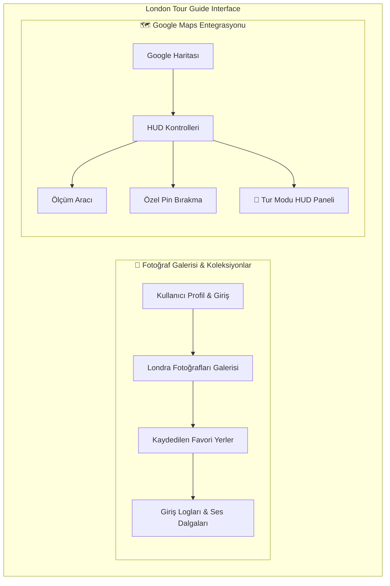

# 📍 London Landmarks Pointer & Interactive Tour Guide

<div align="center">
  
</div>

<br />

Bu uygulama, **Google Gemini API**'nin ses ve işaretleme (pointer/marker) yeteneklerini **Google Maps Platform** ile birleştiren, **Firebase** ile senkronize çalışan interaktif bir Londra gezi rehberidir. Kullanıcılar harita üzerinde gezinebilir, landmark'ları sesle kontrol edebilir, özel pinler bırakıp mesafe ölçebilir ve otomatik **Tur Modu (Tour Mode)** ile kaydedilen yerleri keyifle keşfedebilir.

---

## 🗺️ Görsel Arayüz Yapısı (Visual Layout)

Uygulama, zengin ve modern iki panelli (**Split-Screen**) bir arayüze sahiptir. Aşağıdaki şemada sitenin görsel yerleşimi ve özellikleri gösterilmektedir:



### 📱 Arayüz Özellikleri ve Detayları
* **Sol Panel (Kontrol ve Galeri):** Londra'nın en ikonik yerlerinin (London Eye, Hyde Park, Westminster Abbey, St Pancras Station) yüksek kaliteli fotoğraflarını içerir. Sesli asistanın dalga grafiği (waveform) ve geçmiş logları buradadır.
* **Sağ Panel (Harita ve HUD):** Google Maps haritasını tam ekran barındırır. Üzerinde mesafe ölçüm çizgileri, özel renkli pinler ve parıldayan geçiş efektli **Tur Kontrolleri HUD** yer alır.

---

## ✨ Öne Çıkan Özellikler (Key Features)

### 1. 🧭 Gelişmiş Tur Modu (Tour Mode)
* Haritanın sağ altındaki **Pusula (Compass)** butonuna basarak turu başlatabilirsiniz.
* **Otomatik Geçiş:** Her lokasyonda 8 saniye kalarak bir sonraki durağa otomatik yumuşak geçiş (panning) yapar.
* **İki Farklı Tur Seçeneği:**
  1. *Londra İkonları Turu:* Hazır gelen popüler tarihi yerleri sırayla gezdirir.
  2. *Favorilerim Turu:* Sizin işaretlediğiniz favori yerleri, özel pinleri ve fotoğrafları sırayla gezdirir.
* **HUD Kontrol Paneli:** Turu duraklatabilir, sıradaki/önceki yere manuel geçebilir ve alttaki parıldayan neon ilerleme çubuğundan (progress bar) süreyi takip edebilirsiniz.

### 2. 🎙️ Sesli ve İşaretlemeli Yapay Zekâ Rehberi
* Fotoğraflara işaret ederek veya daire içine alarak sesli komutlar verebilirsiniz.
* Örn: *"How do I go from here, to there?"* dediğinizde iki yer arasındaki rotayı otomatik çizer.

### 3. 📏 Cetvel & Mesafe Ölçer (Distance Measurement)
* Harita üzerinde herhangi iki noktaya tıklayarak aralarındaki mesafeyi kilometre (km) veya mil (miles) cinsinden anında ölçebilirsiniz.

### 4. 📌 Özel Renkli Pinler (Custom Pins)
* Haritanın herhangi bir yerine tıklayarak istediğiniz renkte ve isimde özel harita pinleri bırakabilirsiniz.

### 5. ☁️ Firebase Firestore Senkronizasyonu
* Giriş yaptığınızda favorileriniz, özel pinleriniz ve harita işaretçileriniz bulutta güvenle saklanır.

---

## 🔑 Anahtarları (API Keys) Nereden Bulurum?

Uygulamanın çalışması için **`VITE_FIREBASE_API_KEY`** ve **`GEMINI_API_KEY`** gerekmektedir.

### 1. `VITE_FIREBASE_API_KEY` Nasıl Bulunur?
Bu anahtarı edinmenin **3 kolay yolu** vardır:

* **Yöntem A (En Kolay - Hazır Yapılandırmadan Almak):**
  Uygulamanın ana dizininde bulunan **`firebase-applet-config.json`** dosyasını açın. Dosyanın içindeki `"apiKey"` alanında yer alan `AIzaSy...` ile başlayan anahtarı kopyalayıp input alanına yapıştırın.
  
* **Yöntem B (Firebase Konsolu):**
  1. [Firebase Console](https://console.firebase.google.com/) adresine gidin.
  2. Projenizi seçin.
  3. Sol üstteki **Proje Ayarları (Project Settings - Dişli İkonu)** sekmesine tıklayın.
  4. **Genel (General)** sekmesinin altında, "Uygulamalarınız" (Your Apps) bölümündeki Web uygulamanızın altındaki **`apiKey`** değerini kopyalayın.

* **Yöntem C (Google Cloud Konsolu):**
  1. [Google Cloud Console](https://console.cloud.google.com/) adresine gidin.
  2. Firebase projenizi seçin.
  3. Sol menüden **APIs & Services (API'ler ve Servisler) > Credentials (Kimlik Bilgileri)** sayfasına gidin.
  4. **Browser API Key** veya **Firebase App API Key** adıyla listelenen `AIzaSy...` anahtarını kopyalayın.

### 2. `GEMINI_API_KEY` Nasıl Bulunur?
1. [Google AI Studio](https://aistudio.google.com/) adresine gidin.
2. **Get API Key** butonuna tıklayarak yeni bir anahtar oluşturun veya mevcut anahtarınızı kopyalayın.

---

## 🚀 Yerel Kurulum (Local Setup)

Projeyi bilgisayarınızda çalıştırmak için aşağıdaki adımları izleyin:

### Gereksinimler
* Node.js (v18+)
* npm

### Adımlar

1. **Bağımlılıkları Yükleyin:**
   ```bash
   npm install
   ```

2. **Çevre Değişkenlerini Ayarlayın:**
   Ana dizinde `.env` adında bir dosya oluşturun ve içine anahtarlarınızı ekleyin (veya `.env.example` dosyasını kopyalayıp adını `.env` olarak değiştirin):
   ```env
   GEMINI_API_KEY="YOUR_GEMINI_API_KEY"
   VITE_FIREBASE_API_KEY="YOUR_FIREBASE_API_KEY"
   ```

3. **Uygulamayı Başlatın:**
   ```bash
   npm run dev
   ```
   Uygulama tarayıcınızda otomatik olarak **`http://localhost:3000`** adresinde açılacaktır.

---

## 🎨 Kullanılan Teknolojiler

* **Framework:** React 18 (TypeScript) & Vite
* **Tasarım:** Tailwind CSS (Modern Glassmorphism & Karanlık Tema)
* **Animasyonlar:** `motion/react` (Framer Motion)
* **İkonlar:** `lucide-react`
* **Harita:** `@vis.gl/react-google-maps` & Google Maps JS API
* **Veritabanı:** Firebase Auth & Firestore DB
* **Yapay Zeka:** `@google/genai` (Gemini SDK)

---

<div align="center">
  <p>Uygulama üzerinde harika turlar dileriz! 🧭✨</p>
</div>
